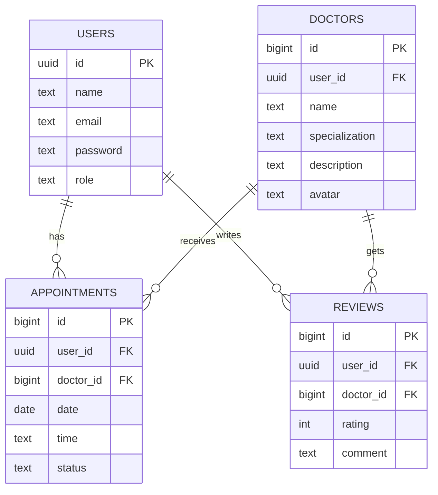

# Онлайн-запись к ЛОРу (11 класс)

Полностью рабочий учебный проект на **Frontend + Supabase** без собственного backend сервера.

## 1) Полное описание проекта

**Название:** MediSlot  
**Цель:** дать пациенту возможность онлайн записаться к ЛОРу, а специалисту и админу управлять записями.

### Функции

- Регистрация и авторизация через Supabase Auth
- Роли: patient / doctor / admin
- Просмотр карточек специалистов
- Автоматическое создание карточки врача при регистрации (роль doctor)
- Выбор даты и свободного времени
- Создание записи на прием
- Отмена записи пациентом
- Подтверждение записи специалистом
- Личный кабинет пациента (мои записи)
- Панель специалиста (расписание)
- Админ-панель управления ролями пользователей

### SMART

- Specific: сайт записи к врачу
- Measurable: пользователь может пройти полный путь от регистрации до записи
- Achievable: frontend + бесплатный Supabase
- Relevant: медицинская цифровизация
- Time-bound: реализация за 1 неделю

## 2) ER-диаграмма базы данных



## 3) SQL для создания таблиц

Полный SQL: `supabase/schema.sql`.

Что делает скрипт:

- создаёт 4 таблицы (`users`, `doctors`, `appointments`, `reviews`)
- создаёт enum для ролей и статусов
- добавляет индексы
- включает RLS политики безопасности
- добавляет триггер авто-создания профиля после регистрации в Auth
- вставляет двух демо-специалистов

## 4) Код регистрации

Файл: `js/auth.js`, функция `registerUser`.

Важно: если при регистрации выбрана роль `doctor`, дополнительно передаются поля `specialization`, `description`, `avatar` (в `user_metadata`), а триггер в БД автоматически создаёт строку в `doctors` и связывает её по `user_id`.

```js
export async function registerUser({
  name,
  email,
  password,
  role,
  specialization,
  description,
  avatar,
}) {
  const { data: authData, error: authError } = await supabase.auth.signUp({
    email,
    password,
    options: {
      data: { name, role, specialization, description, avatar },
    },
  });
  if (authError) throw authError;
  if (!authData.user) throw new Error("Не удалось создать пользователя");
  return authData;
}
```

## 5) Код логина

Файл: `js/pages/login.js`.

```js
await loginUser({ email, password });

const { data: userData } = await supabase.auth.getUser();
const userId = userData.user?.id;

const { data: profile } = await supabase
  .from("users")
  .select("role")
  .eq("id", userId)
  .single();

if (profile.role === "admin") window.location.href = "admin.html";
else if (profile.role === "doctor") window.location.href = "appointments.html";
else window.location.href = "dashboard.html";
```

## 6) Код записи на прием

Файл: `js/pages/doctors.js`.

```js
const payload = {
  user_id: profile.id,
  doctor_id: selectedDoctorId,
  date: dateInput.value,
  time: selectedTime,
  status: "pending",
};

const { error } = await supabase.from("appointments").insert(payload);
if (error) showToast(error.message);
```

## 7) Код получения данных из БД

Пример (мои записи) из `js/pages/dashboard.js`:

```js
const { data, error } = await supabase
  .from("appointments")
  .select("id, date, time, status, doctors(name, specialization)")
  .eq("user_id", profile.id)
  .order("date", { ascending: true });
```

Пример (все пользователи для админа) из `js/pages/admin.js`:

```js
const { data, error } = await supabase
  .from("users")
  .select("id, name, email, role")
  .order("name", { ascending: true });
```

## 8) UI дизайн страниц

Сделан минималистичный современный стиль:

- карточки врачей с фото и специализацией
- блок выбора даты и сетка временных слотов
- статусы записи с цветовой индикацией
- адаптивная верстка для телефона и ПК
- плавные анимации появления
- единый визуальный стиль для всех страниц

Основные стили: `css/style.css`.

## 9) Структура папок проекта

```text
nazym/
  admin.html
  appointments.html
  dashboard.html
  doctors.html
  index.html
  login.html
  register.html
  README.md
  css/
    style.css
  js/
    auth.js
    common.js
    config.js
    supabaseClient.js
    pages/
      admin.js
      appointments.js
      dashboard.js
      doctors.js
      index.js
      login.js
      register.js
  supabase/
    schema.sql
```

## 10) План тестирования

### Функциональные тесты

1. Регистрация нового пациента -> успешный вход.
2. Логин пациента -> переход в dashboard.
3. Просмотр врачей -> отображаются карточки.
4. Выбор даты/времени -> запись создается со статусом `pending`.
5. Отмена пациентом -> статус `cancelled`.
6. Логин специалиста -> видно расписание.
7. Подтверждение специалистом -> статус меняется на `confirmed`.
8. Логин админа -> можно менять роли пользователей.

### Негативные тесты

1. Пустые поля в форме -> браузер не отправляет форму.
2. Неверный пароль -> ошибка входа.
3. Попытка доступа к `admin.html` без роли admin -> редирект.
4. Бронирование занятого времени -> кнопка слота недоступна.

### Адаптивность

1. Проверка на ширине 375px.
2. Проверка на планшете (768px).
3. Проверка на десктопе (1440px).

## 11) Что сказать на защите (Viva)

Короткий сценарий:

1. "Я разработал frontend-приложение онлайн-записи к ЛОРу без собственного сервера."
2. "Для базы и авторизации использовал Supabase Free Tier: Auth + PostgreSQL + RLS."
3. "Система ролей включает пациента, специалиста и администратора."
4. "Пациент выбирает врача, дату и свободный слот, создаёт запись."
5. "Специалист подтверждает или отменяет заявки в панели расписания."
6. "Админ управляет ролями пользователей в отдельной панели."
7. "Безопасность реализована через Row Level Security политики и проверку auth.uid()."
8. "Проект деплоится бесплатно на Vercel и полностью работает в браузере."

### Ожидаемые вопросы и ответы

- Почему без backend?  
  Потому что Supabase предоставляет готовые API и Auth, а RLS закрывает прямой доступ к данным.
- Где хранится пароль?  
  Реальный пароль хранится в Supabase Auth, в таблице `users.password` используется техническое значение `auth_managed`.
- Как предотвращается двойное бронирование?  
  Через уникальный индекс `(doctor_id, date, time)` и отключение занятого слота в UI.

## 12) Как развернуть бесплатно

### A. Supabase

1. Создать проект в Supabase.
2. В SQL Editor выполнить `supabase/schema.sql`.
3. В Auth -> Providers включить Email/Password.
4. В Auth -> Email можно отключить Confirm email (для демо).
5. Скопировать `Project URL` и `anon public key`.
6. В `js/config.js` вставить значения.

### B. Vercel

1. Загрузить проект в GitHub репозиторий.
2. В Vercel -> New Project -> Import из GitHub.
3. Framework: Other.
4. Build command: пусто.
5. Output directory: пусто (корень).
6. Нажать Deploy.

После деплоя сайт сразу работает как статический frontend.

---

## Быстрый старт локально

Можно открыть проект через Live Server в VS Code или любой статический сервер.

Важно: не запускать как `file://`, потому что ES modules могут блокироваться браузером.
